----------
# Lab 2 - Classification of Human Activities

In this notebook we will look to files acquired in the previous class to extract meaninful information and perform the classification of the 4 Human Activities.
    
To process biosignals, we will use the BioSPPy toolbox: https://github.com/PIA-Group/BioSPPy

Index:
    1. Data Loading
    2. Data Visualization
    3. Filtering
    4. Feature Extraction
    5. Classification

# 1. Opening Recorded Data in Python

Biosignals data is usually in the following formats:
* csv (https://realpython.com/python-csv/)  -- the data type given by Google Science Journal.
* txt (https://www.geeksforgeeks.org/reading-writing-text-files-python/)
* hdf5 (https://stackoverflow.com/questions/28170623/how-to-read-hdf5-files-in-python)

----------
## 1.1. Import libraries

Install the useful packages for the next steps:
The command ">/dev/null 2>&1" hides the internal steps being taken.

Check if no import gives error.


```python
import numpy as np #NumPy is the fundamental package for scientific computing with Python. 
import matplotlib.pyplot as plt #Matplotlib is a Python 2D plotting library
import biosppy as bp #A toolbox for biosignal processing written in Python.
from pylab import *
import os #The OS module in Python provides a way of using operating system dependent functionality.
import pandas as pd
import seaborn
```
----------
## 1.2. Load data files

Create a data file inside your current directory and place inside the folder you put in the Teams applicataion with all your acquisitions.


```python
path = 'Data/ist186690/'  # Locate a recording on your hard drive where the data is located
directories = sort(os.listdir(path))  # Display all files in the path directory
directories
```


    array(['Ist186690 lab 1 coronal plane 180°.csv',
           'Ist186690 lab 1 coronal plane 90°.csv',
           'Ist186690 lab 1 sagittal plane 180°.csv',
           'Ist186690 lab 1 sagittal plane 90°.csv'], dtype='<U39')


Load the data file. Starting per example by the "'Ist83743-Lab1 180_ coronal.csv' file, acessible throught the path + directories[0] command.


```python
data = pd.read_csv(path + directories[0])
data  # Display data in a dataframe format from Ist111111-Lab1 180_ coronal.csv 
```


<div>
<style scoped>
    .dataframe tbody tr th:only-of-type {
        vertical-align: middle;
    }

    .dataframe tbody tr th {
        vertical-align: top;
    }

    .dataframe thead th {
        text-align: right;
    }
</style>
<table border="1" class="dataframe">
  <thead>
    <tr style="text-align: right;">
      <th></th>
      <th>relative_time</th>
      <th>DecibelSource</th>
      <th>AccX</th>
      <th>AccY</th>
      <th>AccZ</th>
    </tr>
  </thead>
  <tbody>
    <tr>
      <th>0</th>
      <td>0</td>
      <td>28.737454</td>
      <td>NaN</td>
      <td>NaN</td>
      <td>NaN</td>
    </tr>
    <tr>
      <th>1</th>
      <td>37</td>
      <td>28.033005</td>
      <td>NaN</td>
      <td>NaN</td>
      <td>NaN</td>
    </tr>
    <tr>
      <th>2</th>
      <td>69</td>
      <td>NaN</td>
      <td>6.103006</td>
      <td>-6.464542</td>
      <td>2.614548</td>
    </tr>
    <tr>
      <th>3</th>
      <td>78</td>
      <td>25.439185</td>
      <td>NaN</td>
      <td>NaN</td>
      <td>NaN</td>
    </tr>
    <tr>
      <th>4</th>
      <td>102</td>
      <td>NaN</td>
      <td>7.762239</td>
      <td>-6.100612</td>
      <td>2.892284</td>
    </tr>
    <tr>
      <th>5</th>
      <td>117</td>
      <td>23.174430</td>
      <td>NaN</td>
      <td>NaN</td>
      <td>NaN</td>
    </tr>
    <tr>
      <th>6</th>
      <td>157</td>
      <td>22.851264</td>
      <td>NaN</td>
      <td>NaN</td>
      <td>NaN</td>
    </tr>
    <tr>
      <th>7</th>
      <td>168</td>
      <td>NaN</td>
      <td>6.730307</td>
      <td>NaN</td>
      <td>NaN</td>
    </tr>
    <tr>
      <th>8</th>
      <td>169</td>
      <td>NaN</td>
      <td>6.998465</td>
      <td>-6.203566</td>
      <td>2.171607</td>
    </tr>
    <tr>
      <th>9</th>
      <td>198</td>
      <td>23.232095</td>
      <td>NaN</td>
      <td>NaN</td>
      <td>NaN</td>
    </tr>
    <tr>
      <th>10</th>
      <td>222</td>
      <td>NaN</td>
      <td>7.154093</td>
      <td>NaN</td>
      <td>NaN</td>
    </tr>
    <tr>
      <th>11</th>
      <td>223</td>
      <td>NaN</td>
      <td>NaN</td>
      <td>-6.275394</td>
      <td>2.947352</td>
    </tr>
    <tr>
      <th>12</th>
      <td>237</td>
      <td>22.477692</td>
      <td>NaN</td>
      <td>NaN</td>
      <td>NaN</td>
    </tr>
    <tr>
      <th>13</th>
      <td>278</td>
      <td>21.795047</td>
      <td>NaN</td>
      <td>NaN</td>
      <td>NaN</td>
    </tr>
    <tr>
      <th>14</th>
      <td>284</td>
      <td>NaN</td>
      <td>7.146910</td>
      <td>-6.167652</td>
      <td>2.688771</td>
    </tr>
    <tr>
      <th>15</th>
      <td>317</td>
      <td>19.209167</td>
      <td>NaN</td>
      <td>NaN</td>
      <td>NaN</td>
    </tr>
    <tr>
      <th>16</th>
      <td>342</td>
      <td>NaN</td>
      <td>6.873963</td>
      <td>NaN</td>
      <td>NaN</td>
    </tr>
    <tr>
      <th>17</th>
      <td>343</td>
      <td>NaN</td>
      <td>6.715941</td>
      <td>-6.273000</td>
      <td>2.906650</td>
    </tr>
    <tr>
      <th>18</th>
      <td>357</td>
      <td>15.815466</td>
      <td>NaN</td>
      <td>NaN</td>
      <td>NaN</td>
    </tr>
    <tr>
      <th>19</th>
      <td>397</td>
      <td>20.123334</td>
      <td>NaN</td>
      <td>NaN</td>
      <td>NaN</td>
    </tr>
    <tr>
      <th>20</th>
      <td>403</td>
      <td>NaN</td>
      <td>6.601016</td>
      <td>-6.471725</td>
      <td>2.789330</td>
    </tr>
    <tr>
      <th>21</th>
      <td>437</td>
      <td>18.685926</td>
      <td>NaN</td>
      <td>NaN</td>
      <td>NaN</td>
    </tr>
    <tr>
      <th>22</th>
      <td>462</td>
      <td>NaN</td>
      <td>6.766221</td>
      <td>NaN</td>
      <td>NaN</td>
    </tr>
    <tr>
      <th>23</th>
      <td>463</td>
      <td>NaN</td>
      <td>6.778192</td>
      <td>-6.340040</td>
      <td>2.487652</td>
    </tr>
    <tr>
      <th>24</th>
      <td>478</td>
      <td>17.120378</td>
      <td>NaN</td>
      <td>NaN</td>
      <td>NaN</td>
    </tr>
    <tr>
      <th>25</th>
      <td>518</td>
      <td>14.346544</td>
      <td>NaN</td>
      <td>NaN</td>
      <td>NaN</td>
    </tr>
    <tr>
      <th>26</th>
      <td>523</td>
      <td>NaN</td>
      <td>6.881146</td>
      <td>-6.244269</td>
      <td>2.633702</td>
    </tr>
    <tr>
      <th>27</th>
      <td>524</td>
      <td>NaN</td>
      <td>7.072688</td>
      <td>-6.330462</td>
      <td>2.755810</td>
    </tr>
    <tr>
      <th>28</th>
      <td>558</td>
      <td>16.776772</td>
      <td>NaN</td>
      <td>NaN</td>
      <td>NaN</td>
    </tr>
    <tr>
      <th>29</th>
      <td>596</td>
      <td>NaN</td>
      <td>7.055928</td>
      <td>NaN</td>
      <td>NaN</td>
    </tr>
    <tr>
      <th>...</th>
      <td>...</td>
      <td>...</td>
      <td>...</td>
      <td>...</td>
      <td>...</td>
    </tr>
    <tr>
      <th>2129</th>
      <td>44607</td>
      <td>NaN</td>
      <td>6.759038</td>
      <td>-7.340847</td>
      <td>0.057463</td>
    </tr>
    <tr>
      <th>2130</th>
      <td>44618</td>
      <td>15.390257</td>
      <td>NaN</td>
      <td>NaN</td>
      <td>NaN</td>
    </tr>
    <tr>
      <th>2131</th>
      <td>44658</td>
      <td>13.659119</td>
      <td>NaN</td>
      <td>NaN</td>
      <td>NaN</td>
    </tr>
    <tr>
      <th>2132</th>
      <td>44678</td>
      <td>NaN</td>
      <td>6.605804</td>
      <td>NaN</td>
      <td>NaN</td>
    </tr>
    <tr>
      <th>2133</th>
      <td>44679</td>
      <td>NaN</td>
      <td>6.225114</td>
      <td>-7.620977</td>
      <td>-0.062251</td>
    </tr>
    <tr>
      <th>2134</th>
      <td>44698</td>
      <td>19.978036</td>
      <td>NaN</td>
      <td>NaN</td>
      <td>NaN</td>
    </tr>
    <tr>
      <th>2135</th>
      <td>44732</td>
      <td>NaN</td>
      <td>5.837242</td>
      <td>-7.668862</td>
      <td>-0.047885</td>
    </tr>
    <tr>
      <th>2136</th>
      <td>44737</td>
      <td>58.608666</td>
      <td>NaN</td>
      <td>NaN</td>
      <td>NaN</td>
    </tr>
    <tr>
      <th>2137</th>
      <td>44778</td>
      <td>74.886798</td>
      <td>NaN</td>
      <td>NaN</td>
      <td>NaN</td>
    </tr>
    <tr>
      <th>2138</th>
      <td>44802</td>
      <td>NaN</td>
      <td>5.911465</td>
      <td>-7.752662</td>
      <td>-0.100560</td>
    </tr>
    <tr>
      <th>2139</th>
      <td>44817</td>
      <td>58.940379</td>
      <td>NaN</td>
      <td>NaN</td>
      <td>NaN</td>
    </tr>
    <tr>
      <th>2140</th>
      <td>44851</td>
      <td>NaN</td>
      <td>5.547535</td>
      <td>-7.802942</td>
      <td>0.160416</td>
    </tr>
    <tr>
      <th>2141</th>
      <td>44852</td>
      <td>NaN</td>
      <td>NaN</td>
      <td>NaN</td>
      <td>0.148445</td>
    </tr>
    <tr>
      <th>2142</th>
      <td>44858</td>
      <td>52.308962</td>
      <td>NaN</td>
      <td>NaN</td>
      <td>NaN</td>
    </tr>
    <tr>
      <th>2143</th>
      <td>44898</td>
      <td>44.839976</td>
      <td>NaN</td>
      <td>NaN</td>
      <td>NaN</td>
    </tr>
    <tr>
      <th>2144</th>
      <td>44910</td>
      <td>NaN</td>
      <td>6.821289</td>
      <td>-7.448589</td>
      <td>-0.521952</td>
    </tr>
    <tr>
      <th>2145</th>
      <td>44938</td>
      <td>39.734047</td>
      <td>NaN</td>
      <td>NaN</td>
      <td>NaN</td>
    </tr>
    <tr>
      <th>2146</th>
      <td>44977</td>
      <td>35.777545</td>
      <td>NaN</td>
      <td>NaN</td>
      <td>NaN</td>
    </tr>
    <tr>
      <th>2147</th>
      <td>44981</td>
      <td>NaN</td>
      <td>7.041562</td>
      <td>-7.367184</td>
      <td>0.316044</td>
    </tr>
    <tr>
      <th>2148</th>
      <td>45017</td>
      <td>30.230645</td>
      <td>NaN</td>
      <td>NaN</td>
      <td>NaN</td>
    </tr>
    <tr>
      <th>2149</th>
      <td>45028</td>
      <td>NaN</td>
      <td>6.246663</td>
      <td>-7.539571</td>
      <td>0.584203</td>
    </tr>
    <tr>
      <th>2150</th>
      <td>45058</td>
      <td>25.420178</td>
      <td>NaN</td>
      <td>NaN</td>
      <td>NaN</td>
    </tr>
    <tr>
      <th>2151</th>
      <td>45087</td>
      <td>NaN</td>
      <td>6.167652</td>
      <td>NaN</td>
      <td>NaN</td>
    </tr>
    <tr>
      <th>2152</th>
      <td>45088</td>
      <td>NaN</td>
      <td>5.988081</td>
      <td>-7.606611</td>
      <td>0.969681</td>
    </tr>
    <tr>
      <th>2153</th>
      <td>45098</td>
      <td>24.710427</td>
      <td>NaN</td>
      <td>NaN</td>
      <td>NaN</td>
    </tr>
    <tr>
      <th>2154</th>
      <td>45137</td>
      <td>17.777957</td>
      <td>NaN</td>
      <td>NaN</td>
      <td>NaN</td>
    </tr>
    <tr>
      <th>2155</th>
      <td>45147</td>
      <td>NaN</td>
      <td>5.777385</td>
      <td>NaN</td>
      <td>NaN</td>
    </tr>
    <tr>
      <th>2156</th>
      <td>45148</td>
      <td>NaN</td>
      <td>5.614574</td>
      <td>-7.405492</td>
      <td>0.517163</td>
    </tr>
    <tr>
      <th>2157</th>
      <td>45177</td>
      <td>21.133763</td>
      <td>NaN</td>
      <td>NaN</td>
      <td>NaN</td>
    </tr>
    <tr>
      <th>2158</th>
      <td>45211</td>
      <td>NaN</td>
      <td>7.087053</td>
      <td>-7.003254</td>
      <td>1.142069</td>
    </tr>
  </tbody>
</table>
<p>2159 rows × 5 columns</p>
</div>


```python
data.columns  # Shows the file headers
```


    Index(['relative_time', 'DecibelSource', 'AccX', 'AccY', 'AccZ'], dtype='object')


```python
data.values  # Converts the dataframe into a np.array
```


    array([[ 0.00000000e+00,  2.87374540e+01,             nan,
                        nan,             nan],
           [ 3.70000000e+01,  2.80330047e+01,             nan,
                        nan,             nan],
           [ 6.90000000e+01,             nan,  6.10300636e+00,
            -6.46454191e+00,  2.61454821e+00],
           ...,
           [ 4.51480000e+04,             nan,  5.61457443e+00,
            -7.40549183e+00,  5.17163336e-01],
           [ 4.51770000e+04,  2.11337625e+01,             nan,
                        nan,             nan],
           [ 4.52110000e+04,             nan,  7.08705330e+00,
            -7.00325394e+00,  1.14206910e+00]])


```python
data['AccX'].values  # You can acess all the column headers
```


    array([       nan,        nan, 6.10300636, ..., 5.61457443,        nan,
           7.0870533 ])


```python
data.values[1]  # Alternative way of acessing columns
```


    array([37.        , 28.03300473,         nan,         nan,         nan])


```python
#drop nan values, 
AccX = data.dropna(subset=['AccX'])['AccX'].values  # Drop nan values
timeX = data.dropna(subset=['AccX'])['relative_time'].values

#do the same for AccY, timeY; AccZ, timeZ; Sound, timeS

AccY = data.dropna(subset=['AccY'])['AccY'].values  # Drop nan values
timeY = data.dropna(subset=['AccY'])['relative_time'].values
AccZ = data.dropna(subset=['AccZ'])['AccZ'].values  # Drop nan values
timeZ = data.dropna(subset=['AccZ'])['relative_time'].values
Sound = data.dropna(subset=['DecibelSource'])['DecibelSource'].values  # Drop nan values
timeS = data.dropna(subset=['DecibelSource'])['relative_time'].values

```

# 2. Data Visualization

For visualization we will use the library matplotlib.

## 2.1 Plot one activity


```python
seaborn.set()  # Set the Seaborn library

#PLOT ENTIRE ACTIVITY
my_dpi = 100
plt.figure(figsize=(560 / my_dpi, 200 / my_dpi), dpi=my_dpi)
plt.tight_layout()

#Try with X, Y, Z and Sound
xaxis = timeS[:]
yaxis = Sound[:]
l = 'Sound'

plt.plot(xaxis, yaxis, label=str(l)+" axis") #plot each axis
plt.xlabel("Time (s)")
plt.ylabel("Accelerometer (m/s$^2$)")
plt.legend()
# plt.savefig('AccX.eps', dpi=300, format='eps', bbox_inches='tight') to save the figure
plt.show()
```


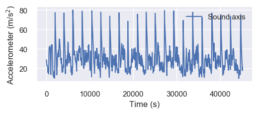


## 2.2 Plot all activities

Likewise for the remaning axis and the decibels data for all activities.


```python
#Plot different activities:

fig = plt.figure(figsize=(20,20))
sp = 0
for activity_name in directories:
    data_activity = pd.read_csv(path + activity_name)
    activity_name = activity_name[:-4] #remove ".csv" from avtivity name
    plt.title(activity_name)
    
    for sensor in data_activity.columns[1:]:
        sp += 1
        plt.subplot(4,4,sp)
        Y = data_activity.dropna(subset=[sensor])[sensor].values  # Drop nan values
        X = data_activity.dropna(subset=[sensor])['relative_time'].values
        plt.plot(X,Y,label=sensor)
        plt.legend()
        
plt.show()
        
#as an exercise, improve this plot to show each sensor in a row (activities will be columns)        
```


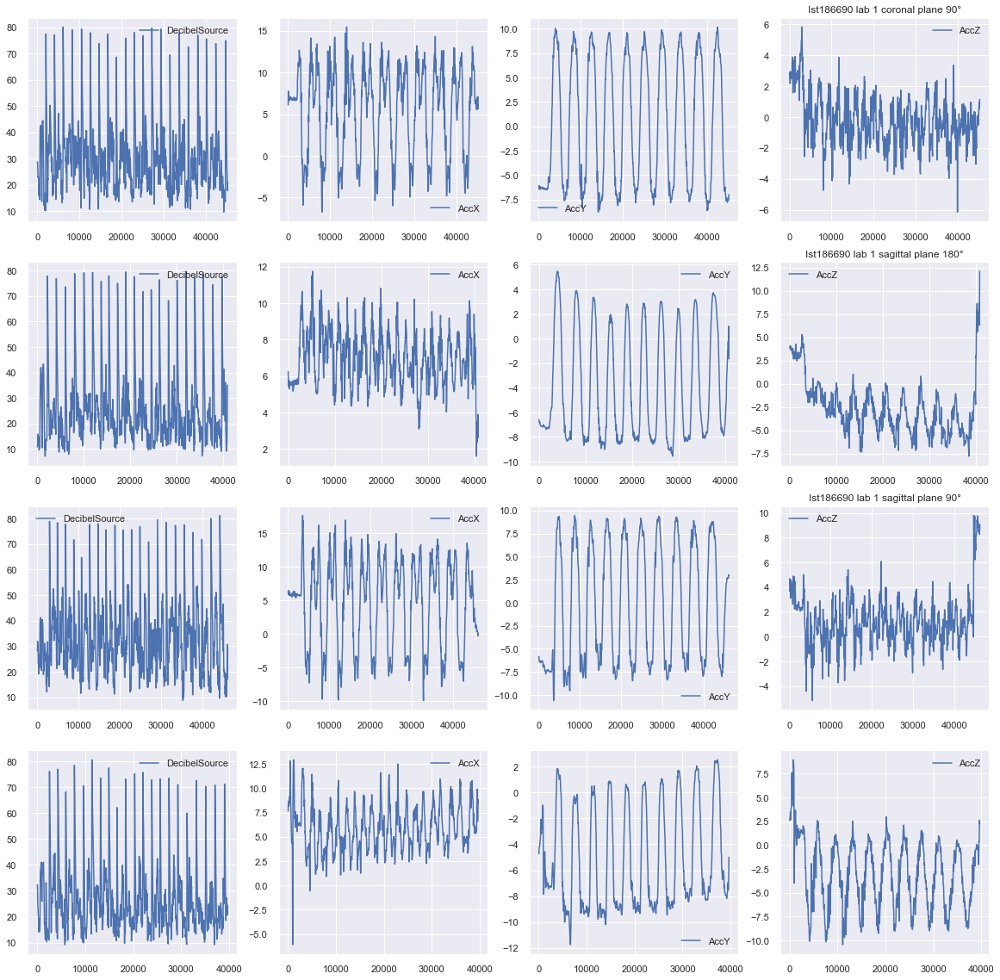


# 3. Segmentation

## 3.1. Find Segmentation Indexes

For segmentation, we will use sound peaks. Function "find_peaks" of scipy library allows to find the best peaks in an array. These function receives two thresholds:
  >  **distance** - the minimum distance between consecutive peaks
  <br>
  >  **height** - the minimum height to be considered a peak

In the following cell we compute sound_peaks and showed them as vertical lines against sound and AccY signals. It not all peaks are found, change **distance** and **height** to meet your values, until 20 peaks are found for each activity.


```python
from scipy.signal import find_peaks

#use this function to find the best peaks from the sound signal, you should find 20 peaks
def find_sound_peaks(dir_name):
    data_activity = pd.read_csv(path + dir_name)
    Sound = data_activity.dropna(subset=['DecibelSource'])['DecibelSource'].values
    timeS = data_activity.dropna(subset=['DecibelSource'])['relative_time'].values
    axis = data.columns.tolist()[-1]  # ['DecibelSource']
    flags_idx,_ = find_peaks(Sound, distance=20, height=60) #change height and distance to find 20 peaks (use plot for help)   

    return timeS[flags_idx]
    

dir_name = directories[1] #change the directory to see if all peaks are found for all activities 

data_activity = pd.read_csv(path + dir_name)
Sound = data_activity.dropna(subset=['DecibelSource'])['DecibelSource'].values
timeS = data_activity.dropna(subset=['DecibelSource'])['relative_time'].values
AccY = data_activity.dropna(subset=['AccY'])['AccY'].values
timeY = data_activity.dropna(subset=['AccY'])['relative_time'].values

sound_peaks = find_sound_peaks(dir_name) #return vector of peaks, odd peaks are starts, and even peaks are stops

plt.figure(figsize=(15,8))
plt.tight_layout()
plt.plot(timeS, Sound, label=a + " axis") #plot sound to check if peaks match
plt.plot(timeY, AccY, label=a + " axis") #plot Y axis for extra insight
for idx_f in range(0, len(flags_idx)-1, 2):
    plt.axvline(sound_peaks[idx_f], ls= "--", color="red") #red is start
    plt.axvline(sound_peaks[idx_f+1], ls= "-.", color="green") #green is stop
plt.xlabel("Time (s)")
plt.ylabel("Accelerometer (m/s$^2$)")
plt.legend(loc='upper right')
plt.show()
```


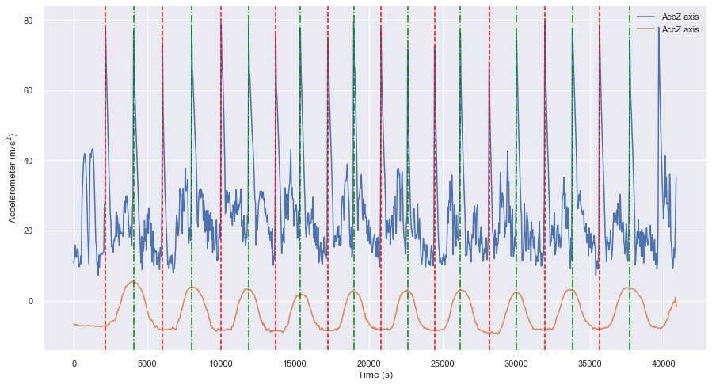


## 3.2 Segment all activities

Using the sound_peaks, segment each activity signal in individual repetitions. 
> 1) For that, run sound peaks for each activity, for each axis (AccX,AccY,AccZ) get signal and time (**Y, X**). 
<br>
> 2) Sound_peaks are based on sound's relative time. Unfortunately that does not correspond to others sensors' time, thus we have to calculate **X_idx** that gives us the corresponding segmentation indexes
<br>
> 3) Then **Y, X** are segmented and saved in a list of repetitions (**Reps_Y**, **Reps_X**)
<br>
> 4) **time_all** and **activity_all** contain all repetitions/corresponding time for all sensors in all activities


```python
#segmentation
activity_all = []
time_all = []
for activity_name in directories:
    sound_peaks = find_sound_peaks(activity_name) #find sound peaks
    data_activity = pd.read_csv(path + activity_name)
    print(sound_peaks)
    activity_reps = []
    time_reps = []
    print(activity_name)
    for sensor in ['AccX','AccY','AccZ']:
        X = data_activity.dropna(subset=[sensor])['relative_time'].values #get time
        X_idx = [np.argmin(abs(X-sp)) for sp in sound_peaks] #get segmentation index 
        
        Y = data_activity.dropna(subset=[sensor])[sensor].values  # Drop nan values
        reps_X = [X[X_idx[xi]:X_idx[xi+1]] for xi in range(0,len(X_idx)-1,2)]
        reps_Y = [Y[X_idx[xi]:X_idx[xi+1]] for xi in range(0,len(X_idx)-1,2)]
        activity_reps += [np.array(reps_Y)]
        time_reps += [np.array(reps_X)]
    activity_all += [np.array(activity_reps)]
    time_all += [np.array(time_reps)]
activity_all = np.array(activity_all)
time_all = np.array(time_all)

print(activity_all.shape)
```

    [ 2018  4058  6098  8238 10478 12558 14618 16738 18780 20998 22998 25058
     27218 29337 31518 33718 35877 38118 40178 42421 44778]
    Ist186690 lab 1 coronal plane 180°.csv
    [ 2158  4058  6018  7998  9998 11859 13698 15358 17218 18978 20838 22639
     24459 26218 28158 30018 31938 33798 35639 37698 39658]
    Ist186690 lab 1 coronal plane 90°.csv
    [ 2939  4841  6839  8819 10699 12679 14719 16620 18820 20819 22839 24879
     26979 29140 31299 33479 35639 37799 39919 42140 44300]
    Ist186690 lab 1 sagittal plane 180°.csv
    [ 2521  4280  5940  7720  9640 11380 13180 14921 16620 18420 20320 22060
     23900 25640 27480 29340 33200 35160 37100 39100]
    Ist186690 lab 1 sagittal plane 90°.csv
    (4, 3, 10)


## 3.3 Data Visualization in Segmented Activities

Now we will look at similarities and differences between activities and repetitions. We can evaluate each Acc axis by itself, or plot 2 or 3 simultaneously:

### 3.3.1. Each source by itself


```python
fig = plt.figure(figsize=(20,10))
sa = 0
all_sensors = ['AccX','AccY','AccZ']
all_activities = ['C180','C90','S180','S90']
for sensor in range(3):
    for activity in range(4):
        sa += 1
        plt.subplot(3,4,sa)
        for xi in range(10):
            x = time_all[activity][sensor][xi] - time_all[activity][sensor][xi][0]
            plt.plot(x,activity_all[activity][sensor][xi])
        #plt.xlim(0,80)
        plt.ylim(-10,15)

        plt.text(1500,10,str(all_sensors[sensor]+'_'+all_activities[activity]))
plt.show()
```


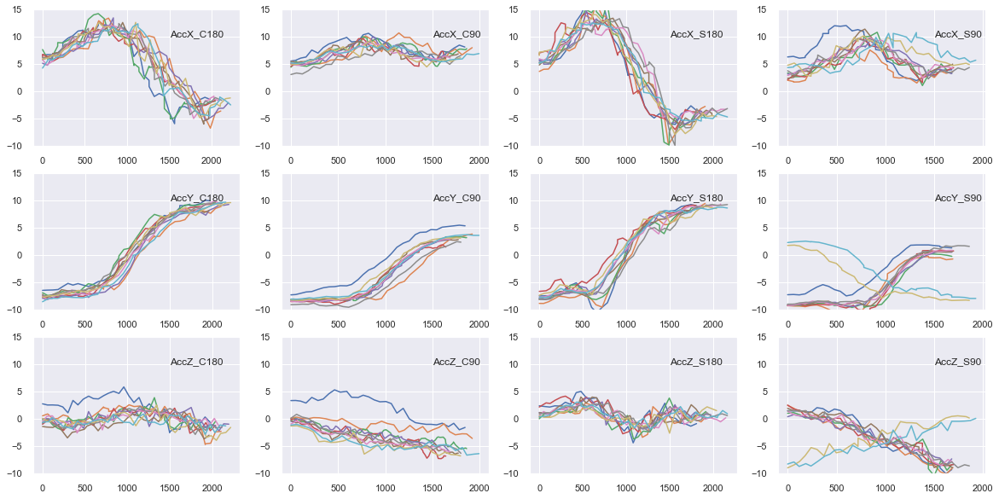


```python
from scipy import signal
X = signal.resample(activity_all[0][0][0],50)
Y = signal.resample(activity_all[0][2][0],50)
plt.plot(X,Y)

```


    [<matplotlib.lines.Line2D at 0x18cdc572cf8>]


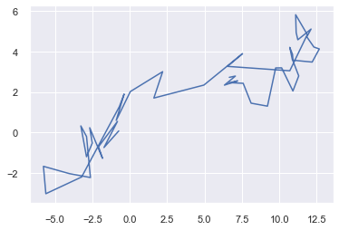


```python
#2D plot two axis conjugation

fig=plt.figure(figsize=(10,10))
colors = ['green','blue','orange','purple']
for activity in range(len(activity_all)):
    for xi in range(10):
        X = signal.resample(activity_all[activity][0][xi],50)
        Y = signal.resample(activity_all[activity][2][xi],50)
        plt.subplot(4,1,activity+1)
        plt.ylim(-20,20)
        plt.xlim(-20,20)    
        plt.scatter(X,Y, c=colors[activity])
    plt.text(21,21,directories[activity])
    
plt.show()
```


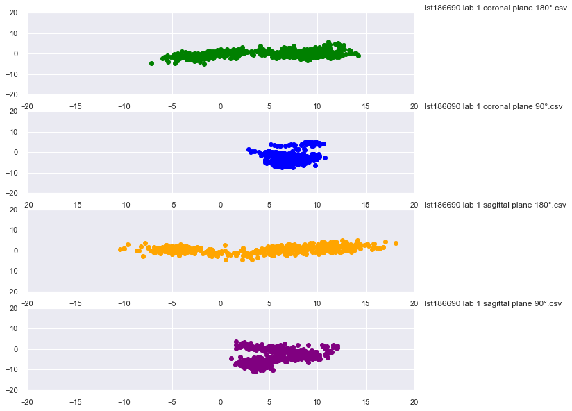


```python
#3d plot all axis conjugation

from mpl_toolkits.mplot3d import Axes3D

colors = ['Greens','Blues','Oranges','Purples']

for activity in range(len(activity_all)):
    ax = plt.axes(projection='3d')
    for xi in range(10):
        X = signal.resample(activity_all[activity][0][xi],50)
        Y = signal.resample(activity_all[activity][1][xi],50)
        Z = signal.resample(activity_all[activity][2][xi],50)
        ax.scatter3D(Y,Z,X,c=Z, cmap=colors[activity])
    
    plt.show()
```


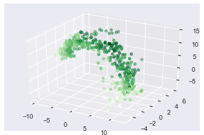


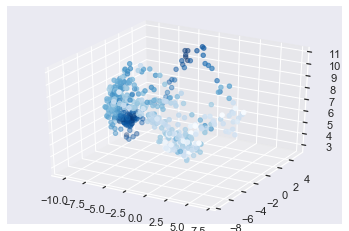


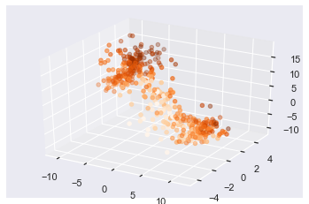


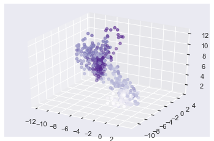


```python
#other representation: dissimilarity-based, derivatives 
```

# 3. Data Representation 
What information can we retrieve from the signal? 

## 3.1 Representation in derivatives

One useful representation could be the signal derivative. The derivative of a time series is the diference between two points separated by a fixed interval. If this interval is 1, its the difference between consecutive points. Calculate the derivative of each sensor with different interval sizes.


```python
def derivative(signal, step):
    new_signal = [(signal[st+step]-signal[st]) for st in range(0,len(signal)-step,step)]
    return np.array(new_signal), np.arange(0,len(signal)-step,step)

fig = plt.figure(figsize=(20,10))
sa = 0
all_sensors = ['AccX','AccY','AccZ']
all_activities = ['C180','C90','S180','S90']
for sensor in range(3):
    for activity in range(4):
        sa += 1
        plt.subplot(3,4,sa)
        for xi in range(10):
            
            y,x = derivative(activity_all[activity][sensor][xi],10)
            x_time = time_all[activity][sensor][xi] - time_all[activity][sensor][xi][0] 
            plt.scatter(x_time[x],y,c='blue')
            plt.plot(x_time, activity_all[activity][sensor][xi],c='green')
        #plt.xlim(-5,80)
        plt.ylim(-10,15)

        plt.text(60,10,str(all_sensors[sensor]+'_'+all_activities[activity]))
plt.show()
```


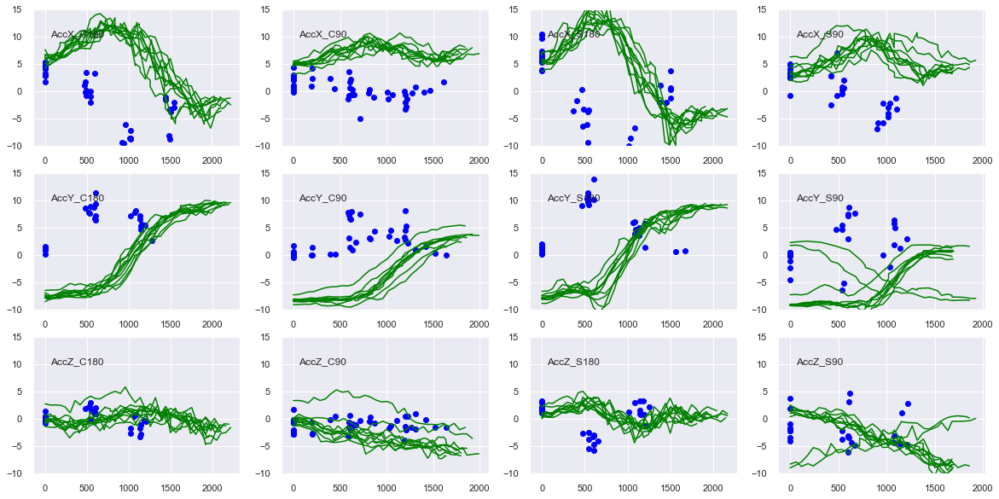


## 3.2 Representation in features


Besides its evolution through time, signals can be represented by other information, such as their spectrum or even some easy metrics. A particular signal can be evaluated in terms of their mean, max and minimum amplitudes, variance, amongst other metrics.


```python

fig = plt.figure(figsize=(20,10))
sa = 0
all_sensors = ['AccX','AccY','AccZ']
all_activities = ['C180','C90','S180','S90']
for sensor in range(3):
    for activity in range(4):
        sa += 1
        plt.subplot(3,4,sa)
        for xi in range(10):
            sig = activity_all[activity][sensor][xi]
            plt.scatter(np.std(sig),np.mean(sig),c='blue')
            plt.scatter(np.min(sig),np.max(sig),c='green')
            #x_time = time_all[activity][sensor][xi] - time_all[activity][sensor][xi][0] 
            #plt.scatter(x_time[x],y,c='blue')
            #plt.plot(x_time, activity_all[activity][sensor][xi],c='green')
        plt.xlim(-15,10)
        plt.ylim(-10,20)

        plt.text(3,15,str(all_sensors[sensor]+'_'+all_activities[activity]))
plt.show()
```


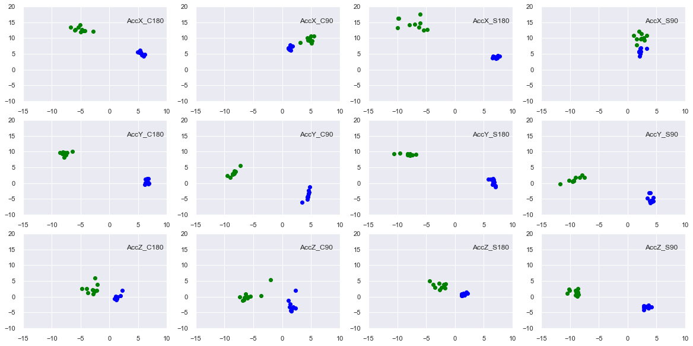


## 3.3 Dissimilarity Based

We can also use distance measures to evaluate the similarity/difference between the repetitions and specific templates. 

### 3.3.1 Choose Templates

Many signals can be used as templates, in this case, we found the mean signal for each activity in each sensor, thus we have 12 templates to compare to (3 templates per activity). These are all saved in variable **means**


```python
fig = plt.figure(figsize=(20,10))
sa = 0
all_sensors = ['AccX','AccY','AccZ']
all_activities = ['C180','C90','S180','S90']
means = []
for sensor in range(3):
    means_s = []
    for activity in range(4):
        sa += 1
        plt.subplot(3,4,sa)
        mean_ = np.mean([signal.resample(activity_all[activity][sensor][xo],40) for xo in range(10)],axis=0)
        #plt.plot(np.arange(0,len(x_time,50),mean_,c='k')
        plt.plot(np.arange(0,2000,50),mean_,'k')
        
        means_s+= [mean_]
        #plt.xlim(-15,10)
        #plt.ylim(-10,20)

        #plt.text(3,15,str(all_sensors[sensor]+'_'+all_activities[activity]))
    means += [means_s]
plt.show()
```


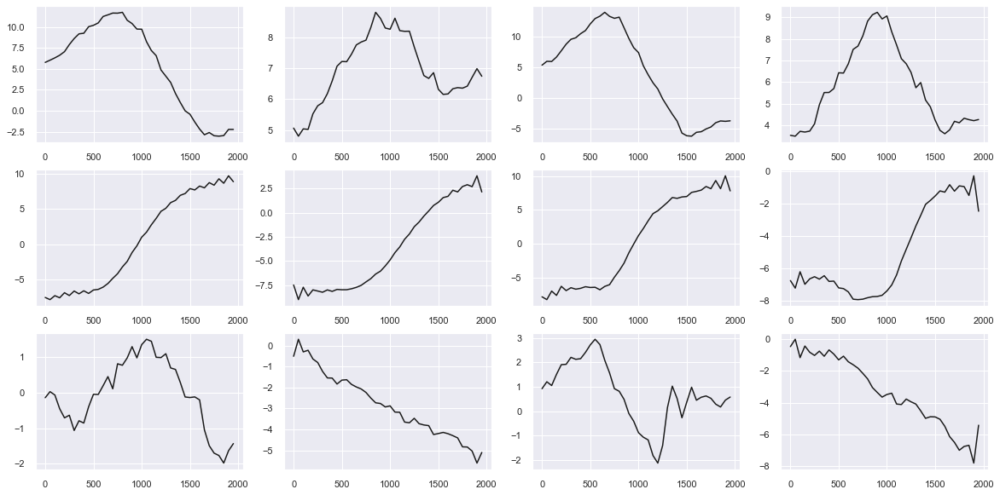


### 3.3.2 Choose distance 

Choose a distance to calculate. Use distance to compare each repetition to all templates. 
Distance can be: pearsonr, euclidean, cosine similarity, ...


```python
from scipy.spatial.distance import euclidean
from scipy.stats import pearsonr
from sklearn.metrics.pairwise import cosine_similarity
Y_TRUE = []
Y_PRED = []
for activity in range(4):
    for xi in range(10):
        Y_TRUE += [activity]
        print('+++'*10 + str(activity) + '+++'*10)
        all_dist = []
        for sensor in range(3):
            sens_dist = []
            sig = signal.resample(activity_all[activity][sensor][xi],40)
            
            for act in range(4):
                #dist = 1/euclidean(sig,means[sensor][act])
                #dist = cosine_similarity(sig.reshape(1,-1), means[sensor][act].reshape(1,-1))[0][0]
                dist,_ = pearsonr(sig, means[sensor][act])
                sens_dist += [dist]
            if sensor == 0:
                dat = pd.DataFrame(sens_dist, columns=['P_'+str(sensor)], index=[0,1,2,3])
            else:
                dat['P_'+str(sensor)] = sens_dist
        Y_PRED += [np.argmax(dat.T.mean())]
        print(dat)
```

    ++++++++++++++++++++++++++++++0++++++++++++++++++++++++++++++
            P_0       P_1       P_2
    0  0.949371  0.996718  0.539928
    1  0.294115  0.987261  0.586324
    2  0.981364  0.993327  0.159198
    3  0.588022  0.904380  0.636787
    ++++++++++++++++++++++++++++++0++++++++++++++++++++++++++++++
            P_0       P_1       P_2
    0  0.880269  0.990495  0.903683
    1  0.503246  0.988556  0.386689
    2  0.746028  0.987514 -0.159315
    3  0.732466  0.907043  0.464246
    ++++++++++++++++++++++++++++++0++++++++++++++++++++++++++++++
            P_0       P_1       P_2
    0  0.906142  0.990301  0.745507
    1  0.173706  0.953381  0.052404
    2  0.963577  0.988691 -0.464189
    3  0.424913  0.818719  0.147648
    ++++++++++++++++++++++++++++++0++++++++++++++++++++++++++++++
            P_0       P_1       P_2
    0  0.984904  0.998383  0.765156
    1  0.410310  0.986215 -0.126877
    2  0.930450  0.996006 -0.552607
    3  0.672153  0.896597 -0.033416
    ++++++++++++++++++++++++++++++0++++++++++++++++++++++++++++++
            P_0       P_1       P_2
    0  0.957404  0.996632  0.711013
    1  0.441717  0.981420 -0.047779
    2  0.868882  0.994980 -0.267197
    3  0.696141  0.890570  0.020856
    ++++++++++++++++++++++++++++++0++++++++++++++++++++++++++++++
            P_0       P_1       P_2
    0  0.960032  0.995318  0.516229
    1  0.416438  0.987586 -0.243615
    2  0.871070  0.993568 -0.495763
    3  0.695863  0.911653 -0.265374
    ++++++++++++++++++++++++++++++0++++++++++++++++++++++++++++++
            P_0       P_1       P_2
    0  0.981063  0.996876  0.656425
    1  0.432752  0.985135 -0.203090
    2  0.944590  0.993367 -0.711891
    3  0.710594  0.891068 -0.251715
    ++++++++++++++++++++++++++++++0++++++++++++++++++++++++++++++
            P_0       P_1       P_2
    0  0.984234  0.994566  0.853797
    1  0.356535  0.962876 -0.074308
    2  0.971108  0.989605 -0.593810
    3  0.647213  0.835878 -0.001672
    ++++++++++++++++++++++++++++++0++++++++++++++++++++++++++++++
            P_0       P_1       P_2
    0  0.976965  0.980906  0.737590
    1  0.382864  0.931335  0.404753
    2  0.937930  0.980569 -0.195850
    3  0.648061  0.782585  0.477927
    ++++++++++++++++++++++++++++++0++++++++++++++++++++++++++++++
            P_0       P_1       P_2
    0  0.966168  0.995302  0.574786
    1  0.386219  0.989699  0.110872
    2  0.956003  0.989074 -0.048055
    3  0.677861  0.905129  0.154311
    ++++++++++++++++++++++++++++++1++++++++++++++++++++++++++++++
            P_0       P_1       P_2
    0  0.568482  0.992909  0.451885
    1  0.839766  0.985646  0.815516
    2  0.564233  0.991661  0.399401
    3  0.840692  0.903195  0.877494
    ++++++++++++++++++++++++++++++1++++++++++++++++++++++++++++++
            P_0       P_1       P_2
    0  0.008407  0.911968  0.207219
    1  0.787641  0.970139  0.882815
    2 -0.157305  0.901929  0.508842
    3  0.625857  0.965461  0.860004
    ++++++++++++++++++++++++++++++1++++++++++++++++++++++++++++++
            P_0       P_1       P_2
    0  0.602206  0.990455  0.198793
    1  0.701001  0.968375  0.913136
    2  0.630932  0.984637  0.511976
    3  0.687922  0.842961  0.846014
    ++++++++++++++++++++++++++++++1++++++++++++++++++++++++++++++
            P_0       P_1       P_2
    0  0.241651  0.979678  0.244631
    1  0.790452  0.979873  0.955312
    2  0.191559  0.981091  0.494453
    3  0.723468  0.924743  0.946908
    ++++++++++++++++++++++++++++++1++++++++++++++++++++++++++++++
            P_0       P_1       P_2
    0 -0.173307  0.790563  0.242975
    1  0.651535  0.870771  0.934164
    2 -0.373612  0.772454  0.486132
    3  0.479521  0.853378  0.891323
    ++++++++++++++++++++++++++++++1++++++++++++++++++++++++++++++
            P_0       P_1       P_2
    0  0.640785  0.972862  0.104430
    1  0.816189  0.989595  0.956459
    2  0.600121  0.969055  0.517073
    3  0.855053  0.942604  0.881309
    ++++++++++++++++++++++++++++++1++++++++++++++++++++++++++++++
            P_0       P_1       P_2
    0  0.438967  0.957773  0.054111
    1  0.958285  0.991905  0.967897
    2  0.309169  0.952625  0.556639
    3  0.927897  0.964867  0.922479
    ++++++++++++++++++++++++++++++1++++++++++++++++++++++++++++++
            P_0       P_1       P_2
    0 -0.111749  0.957372  0.080341
    1  0.757123  0.992980  0.964972
    2 -0.283441  0.953400  0.491553
    3  0.528459  0.964842  0.906156
    ++++++++++++++++++++++++++++++1++++++++++++++++++++++++++++++
            P_0       P_1       P_2
    0  0.651573  0.990810  0.114941
    1  0.817534  0.990758  0.890586
    2  0.582896  0.989366  0.430966
    3  0.861502  0.919479  0.839278
    ++++++++++++++++++++++++++++++1++++++++++++++++++++++++++++++
            P_0       P_1       P_2
    0  0.589136  0.990935 -0.019157
    1  0.903169  0.994524  0.881170
    2  0.526655  0.988851  0.525201
    3  0.905116  0.929638  0.787219
    ++++++++++++++++++++++++++++++2++++++++++++++++++++++++++++++
            P_0       P_1       P_2
    0  0.945994  0.952141 -0.156690
    1  0.357625  0.973368  0.628691
    2  0.979126  0.959072  0.907404
    3  0.614455  0.951692  0.664331
    ++++++++++++++++++++++++++++++2++++++++++++++++++++++++++++++
            P_0       P_1       P_2
    0  0.959566  0.976434 -0.323654
    1  0.425450  0.980347  0.357773
    2  0.965767  0.982100  0.808689
    3  0.689990  0.927840  0.352883
    ++++++++++++++++++++++++++++++2++++++++++++++++++++++++++++++
            P_0       P_1       P_2
    0  0.960603  0.976115 -0.382823
    1  0.350209  0.966407  0.264986
    2  0.985440  0.986718  0.734944
    3  0.614297  0.884988  0.256982
    ++++++++++++++++++++++++++++++2++++++++++++++++++++++++++++++
            P_0       P_1       P_2
    0  0.911001  0.988047 -0.372200
    1  0.140333  0.958711  0.620403
    2  0.975225  0.985882  0.883227
    3  0.440571  0.834758  0.595372
    ++++++++++++++++++++++++++++++2++++++++++++++++++++++++++++++
            P_0       P_1       P_2
    0  0.958682  0.994618 -0.449877
    1  0.276761  0.966497  0.335507
    2  0.991610  0.996750  0.866737
    3  0.556472  0.853470  0.352704
    ++++++++++++++++++++++++++++++2++++++++++++++++++++++++++++++
            P_0       P_1       P_2
    0  0.967532  0.995209 -0.267889
    1  0.267173  0.978065  0.503626
    2  0.993847  0.997785  0.818176
    3  0.552561  0.885645  0.504754
    ++++++++++++++++++++++++++++++2++++++++++++++++++++++++++++++
            P_0       P_1       P_2
    0  0.947731  0.991317 -0.293317
    1  0.310956  0.959109  0.512709
    2  0.966599  0.989322  0.782401
    3  0.590612  0.835737  0.523384
    ++++++++++++++++++++++++++++++2++++++++++++++++++++++++++++++
            P_0       P_1       P_2
    0  0.944734  0.995564 -0.329293
    1  0.339694  0.973372  0.450220
    2  0.974290  0.995214  0.884073
    3  0.592183  0.865158  0.478929
    ++++++++++++++++++++++++++++++2++++++++++++++++++++++++++++++
            P_0       P_1       P_2
    0  0.924895  0.979201 -0.538601
    1  0.137682  0.934238  0.164738
    2  0.981210  0.984048  0.706391
    3  0.432323  0.794760  0.159368
    ++++++++++++++++++++++++++++++2++++++++++++++++++++++++++++++
            P_0       P_1       P_2
    0  0.914538  0.982270 -0.484455
    1  0.122282  0.933142  0.333841
    2  0.977723  0.981910  0.756323
    3  0.423090  0.789209  0.387237
    ++++++++++++++++++++++++++++++3++++++++++++++++++++++++++++++
            P_0       P_1       P_2
    0  0.915437  0.961994  0.197714
    1  0.403291  0.973818  0.949195
    2  0.965514  0.964856  0.631410
    3  0.629965  0.951684  0.981306
    ++++++++++++++++++++++++++++++3++++++++++++++++++++++++++++++
            P_0       P_1       P_2
    0  0.645831  0.959684  0.242340
    1  0.871971  0.971109  0.968453
    2  0.598050  0.966074  0.503551
    3  0.918282  0.948020  0.980095
    ++++++++++++++++++++++++++++++3++++++++++++++++++++++++++++++
            P_0       P_1       P_2
    0  0.552898  0.879680  0.304343
    1  0.830578  0.948236  0.935890
    2  0.459585  0.867738  0.497268
    3  0.916926  0.980996  0.971690
    ++++++++++++++++++++++++++++++3++++++++++++++++++++++++++++++
            P_0       P_1       P_2
    0  0.611149  0.907810  0.231627
    1  0.873532  0.962755  0.959062
    2  0.495933  0.900961  0.539663
    3  0.955649  0.993145  0.979616
    ++++++++++++++++++++++++++++++3++++++++++++++++++++++++++++++
            P_0       P_1       P_2
    0  0.628439  0.920423  0.315409
    1  0.843238  0.975112  0.948930
    2  0.462807  0.914749  0.485000
    3  0.922124  0.983221  0.971126
    ++++++++++++++++++++++++++++++3++++++++++++++++++++++++++++++
            P_0       P_1       P_2
    0  0.464724  0.910955  0.302448
    1  0.895312  0.965253  0.950139
    2  0.311740  0.902086  0.515967
    3  0.915950  0.989067  0.982628
    ++++++++++++++++++++++++++++++3++++++++++++++++++++++++++++++
            P_0       P_1       P_2
    0  0.608630  0.931726  0.231422
    1  0.881267  0.977033  0.950555
    2  0.517038  0.924897  0.562689
    3  0.956785  0.982016  0.985846
    ++++++++++++++++++++++++++++++3++++++++++++++++++++++++++++++
            P_0       P_1       P_2
    0  0.791490  0.970435  0.225562
    1  0.754702  0.989578  0.968563
    2  0.753640  0.969901  0.539544
    3  0.910077  0.961641  0.984140
    ++++++++++++++++++++++++++++++3++++++++++++++++++++++++++++++
            P_0       P_1       P_2
    0  0.409258 -0.893193 -0.173540
    1  0.843495 -0.824208 -0.947860
    2  0.272440 -0.883921 -0.537947
    3  0.837523 -0.625794 -0.926008
    ++++++++++++++++++++++++++++++3++++++++++++++++++++++++++++++
            P_0       P_1       P_2
    0 -0.215770 -0.970817 -0.192003
    1  0.505075 -0.918705 -0.960309
    2 -0.434524 -0.966864 -0.523571
    3  0.378631 -0.749624 -0.942348


```python
from sklearn.metrics import accuracy_score

accuracy = accuracy_score(Y_TRUE, Y_PRED)

print('Final Accuracy ' + str(np.round(accuracy*100,2)) + '%')
```

    Final Accuracy 97.5%

